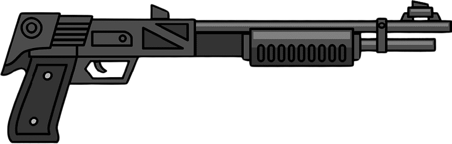

<h1 align="center" id="title">Buckshot TERMINAL: It's You vs. a Loaded Shotgun (Text Game)</h1>

<p align="center"></p>

<p id="description">[THIS GAME IS INSPIRED BY "Buckshot Roulette" GAME ] Ever felt like you're stuck in a bad situation? Try this! Buckshot Terminal is a quick text game where you face a shotgun. Shoot yourself or your opponent - the choice is yours! Will you gamble on your luck or take the safe bet? Each shot is a gamble and there's only one way out alive. Test your nerve in Buckshot Terminal!</p>

<h2>🛠️ Installation Steps:</h2>

<p>1. Download files</p>

```
git clone https://github.com/dip-bash/Buckshot_terminal.git
```

<p>2. run the game</p>

```
python -u ./buckshot_terminal
```

  
  
<h2>💻 Built with</h2>

Technologies used in the project:

*   Python 3.10.12

<h2>Upcoming Updates</h2>

- [ ] Add a story
- [ ] Add more levels
- [ ] Add visuals
- [ ] Add more options
